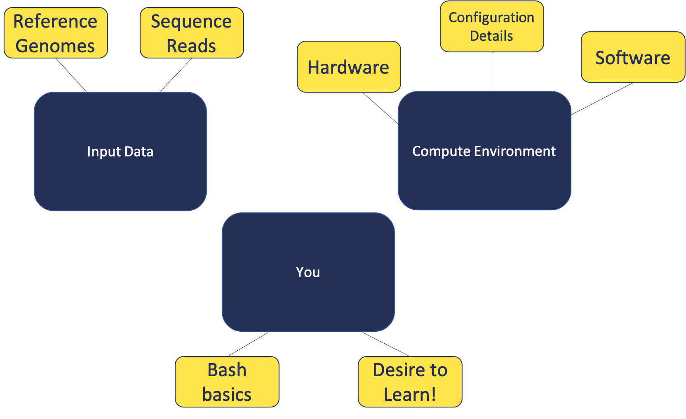
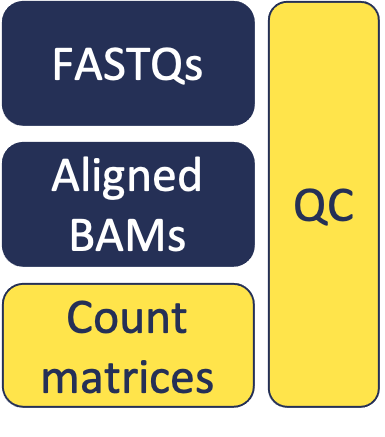

<style type="text/css">
body{ /* Normal  */
      font-size: 14pt;
  }
pre {
  font-size: 12pt
}
</style>

# Additional Information

For this workshop, we've provided a few things to ensure that our experience goes smoothly. In this module, we will discuss in more detail the things needed to perform an RNAseq analysis like this.




# The Compute Environment

Here we're referring to all of the hardware, software, and configuration details of the system where we perform our analysis.

## Hardware

- CPU
- Memory
- Storage

### CPU

CPU stands for Central Processing Unit. In shorthand, people often refer to "the processor". This  retrieves and executes instructions, and is one of the core components of a computing system.

Single vs Multi-Threaded

Many of the most heavily-used bioinformatics software can use multiple threads. This way they can do parallel processing, which can drastically cut down the time to receive results.

There are also plenty of single-threaded bioinformatics programs. Simple python scripts, niche tools, etc. will often not need parallel processing. In these cases, the cost/benefit tradeoff may be too great.

Multi-threaded programs we've used:

- Cutadapt
- STAR / RSEM

Single-threaded programs we've used:

- FastQC
- MultiQC

<details>
<summary>What about clock speed?</summary>

You may be familiar with clock speed of a processor from your experience while buying personal computers. You may've seen specs listed such as `3.3 GHz`, which refers to the CPU's clock speed.

Clock speeds on all modern processors are sufficient for basically all bioinformatics software. Clock speed is generally not a major consideration in choices today.
</details>

<br>
<br>

### Memory

Here we're referring to Random Access Memory, or RAM. RAM provides a limited amount of very fast storage that a process will use within a short time frame.

The memory requirements of various tools vary widely, and many bioinformatics programs require fairly high amounts. This is true for aligners. In the case of the STAR aligner, a very large data structure is loaded into RAM. This allows extremely fast and accurate alignments e.g. to a vertebrate genome, but requires very large amounts of RAM.

Cutadapt, fastQC, and multiQC have more modest memory requirements, so we won't have to consider memory as much in those cases.

### Storage

Here we're referring to disk storage, or persistent storage. This stores large amounts of data for the long term - the information remains even when there is no power to the device. You may sometimes use the phrase "save [the file] to your hard drive", which is referring to persistent storage.

Consider:

- Storage for input files, output files
- Storage during processing

Some input and output files can be quite large. Additionally, several large intermediates are produced during processing, requiring (sometimes considerable) additional storage.

## Software

The software we've been using is free, open-source, and openly licensed. We can inspect the source code, use the program as we wish, modify it, contribute to it, etc. This is the case for many bioinformatics tools. We can appreciate the benefits of community-driven software.

There are tools available for various kinds of bioinformatics tasks. Today we've focused on a few important tasks for RNA sequencing, and used a subset of quality tools for this purpose. Here is a summary of the tasks we've performed and the tools we've used today.

| Task | Tool |
| :--: | ---- |
| Quality Control | [FastQC](https://www.bioinformatics.babraham.ac.uk/projects/fastqc/Help/) |
| Quality Control | [MultiQC](https://multiqc.info/docs/) |
| Read Trimming | [Cutadapt](https://cutadapt.readthedocs.io/en/stable/) |
| Alignment | [STAR](https://github.com/alexdobin/STAR/blob/master/doc/STARmanual.pdf) |
| Gene Quantification | [RSEM](http://deweylab.github.io/RSEM/) |

## System Configuration

### Operating System

The Operating System (OS) is a software layer that handles communication between the hardware devices and with the end user.

In this workshop we've used a Linux operating system. Linux is free and open source. It's widely used in bioinformatics; as you've learned, it can be very powerful.

<details>
<summary>Examples of Operating Systems?</summary>

Examples:

- Microsoft - [Windows](https://en.wikipedia.org/wiki/Microsoft_Windows)
- Apple - [MacOS](https://en.wikipedia.org/wiki/MacOS)
- [FOSS](https://en.wikipedia.org/wiki/Free_and_open-source_software) - [GNU](http://www.gnu.org) / [LINUX](https://en.wikipedia.org/wiki/Linux)
- Google - [Android](https://en.wikipedia.org/wiki/Android_(operating_system))
- Apple - [iOS](https://en.wikipedia.org/wiki/IOS)

Some software is specific to an operating system - developers may focus their time and attention on developing for certain configurations over others, depending on the niche or goal. Often, releases may be limited to certain OS / hardware configurations.

</details>

<br>
<br>

### Local vs Remote

In this workshop, we've used remote computing systems for our analysis. We've seen how we can connect to a remote computer and use it for our purposes. You're likely most familiar with local computing, using a machine that is physically in the same room as you. However, now we can recognize some benefits of remote computing.

<details>
<summary>Why Use Remote Computing?</summary>

Remote computing is sensible in many situations - for economies of scale it's best to have many machines in physical locations that are built and designed for that purpose. This is what it means if you've heard of cloud computing - a type of remote computing, often with convenience services or products built on top of the remote machines. By using remote computing, we can rent powerful hardware that would not be practical for us to buy. We can also scale this up or down to our exact needs, providing great flexibility.

</details>

<details>
<summary>How to Efficiently Manage Remote Computing Resources</summary>

This is a broad topic - job scheduling is a common method for allocating shared compute resources. Consider a job as an individual call to a piece of software. There are many ways to manage resources at the job level.

Resource management and job scheduling at the UMich HPC is handled by SLURM. Quite a large topic of its own, you can read more about these resources [here](https://arc.umich.edu/greatlakes/slurm-user-guide/).

Another large topic which we won't dive into, are workflow managers. These allow similar job management capabilities, but are more flexible since they are not tied to a specific type of system. [Snakemake](https://snakemake.readthedocs.io/en/stable/) is an example of this.

Today we've been aiming for simplicity and transparency, so managed our jobs manually and sequentially. In other words, we wrote and submitted the commands by hand, in order, for illustrative purposes. You can imagine that for large-scale processing, it is incredibly useful to allow software to automate some of these processes for us.

</details>

<br>
<br>

### Software Management

There are many methods for managing software. As a system accumulates changes over time, and as the resulting software installations become more complex (esp. across multi-user systems), the need for software management systems becomes more apparent.

Today we've been using [miniconda](https://docs.conda.io/en/latest/miniconda.html). This provides a good balance of simplicity, flexibility, and utility for software management.

Conda is an open-source, cross-platform, package management and environment management software. It's widely used for packaging and distributing software, particularly in the python community. Note: it is also used for software of many different software languages; it is language-agnostic.

Miniconda is a minimal installation of conda, that provides a lightweight option to get started with.


<br>
<br>


# Summary

Things that we have learned:

- Important aspects of hardware, software, and compute environments to consider
- Important file formats and their contents
- Reference files necessary / where to find
- How to use FastQC, assess quality of reads
- How to transfer files from remote to local computer
- How to prepare a reference for alignment and quantification with RSEM + STAR
- How to combine expression results across samples into a count matrix
- How to use MultiQC to summarize large volumes of QC data.

<br>
<br>



<br>
<br>


# Conda Exercises

Environment recap:

By default you will usually have a single compute environment - one set up specifically for your user. You'll have a set of programs, some configuration details, etc. that are set up according to your preferences.

As mentioned above, when doing data analysis tasks, it can become onerous to create and maintain one environment that satisfies all of your needs. It is good practice to create separate environments according to the specific needs of a project. A metaphor would be putting on different outfits for different occasions or tasks in your life.

Conda is a tool that we've used for managing our software environment for this workshop. We're all currently using the same conda environment that we (the instructors) built ahead of time.

Conda must-know:

- A tool for managing software environments
- Create an environment
- Activate and deactivate an environment

## Conda Activate / Deactivate Exercise

1. Learn about the `which` command - use to reveal the path to a specific software
2. Try `which python`
3. Deactivate our current shared environment with `conda deactivate`
4. Try `which python` again - Is it different now?
5. Activate the environment again with `conda activate /rsd/conda/workshop`


## Conda Create Simple Exercise

1. Check which python version we have in our current environment
2. Create a simple conda environment named `py36` that contains python 3.6 - use the `bioconda` channel
3. Activate the new `py36` environment and verify that you now have python 3.6
4. Deactivate our `py36` environment

```
# Check which python version we're using in our current environment
python --version
# Create a conda environment with python version 3.6, using the bioconda channel
conda create -n py36 -c bioconda python=3.6
# Activate our new conda environment
conda activate py36
# Check our python version now (it should be 3.6)
python --version
# Deactivate our environment
conda deactivate
```

<br>

## Conda Create Exercise (breakout)

Before starting our breakout exercise, we should make sure that we are on the same page. Follow the link below:

[Conda create exercise](Module05b_breakout04_ex.html)

<br>
<br>

---

These materials have been adapted and extended from materials created by the [Harvard Chan Bioinformatics Core (HBC)](http://bioinformatics.sph.harvard.edu/). These are open access materials distributed under the terms of the [Creative Commons Attribution license (CC BY 4.0)](http://creativecommons.org/licenses/by/4.0/), which permits unrestricted use, distribution, and reproduction in any medium, provided the original author and source are credited.
